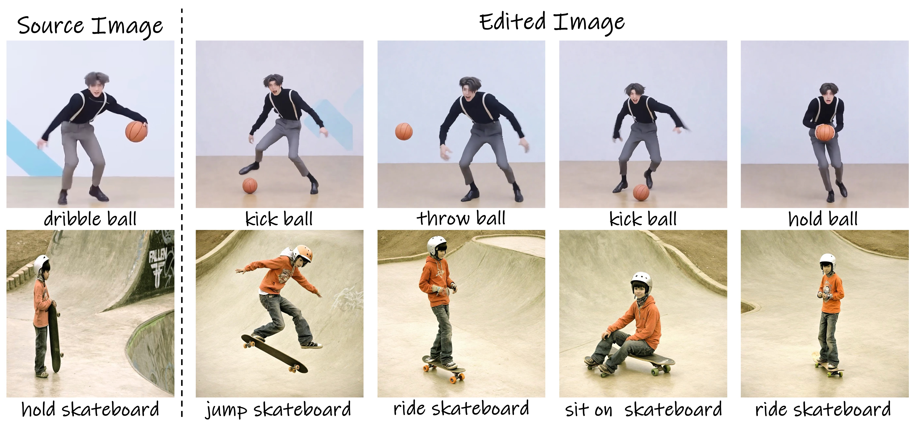

# InteractEdit: Zero-Shot Editing of Human-Object Interactions in Images

[Jiun Tian Hoe](https://jiuntian.com/), 
[Weipeng Hu](https://scholar.google.com/citations?user=zo6ni_gAAAAJ), 
[Wei Zhou](https://scholar.google.com/citations?user=zo6ni_gAAAAJ), 
[Chao Xie](https://scholar.google.com/citations?user=zo6ni_gAAAAJ),
[Ziwei Wang](https://scholar.google.com/citations?user=zo6ni_gAAAAJ),
[Chee Seng Chan](http://cs-chan.com),
[Xudong Jiang](https://personal.ntu.edu.sg/exdjiang/),
[Yap Peng Tan](https://personal.ntu.edu.sg/eyptan/)


[Project Page](https://jiuntian.github.io/interactedit) |
 [arXiv](https://arxiv.org/abs/2503.09130) |
 [Gradio demo (coming soon)]() |
 [Colab (coming soon)]()
 <!-- [paper]() -->
 <!-- [Demo](https://huggingface.co/spaces/interactdiffusion/interactdiffusion) | -->
  <!-- [Video](https://www.youtube.com/watch?v=Uunzufq8m6Y) | -->

[](https://arxiv.org/abs/2503.09130)
[](https://badges.toozhao.com/stats/01JP3YKGCXP3GNAWN6PNJ2V5J0 "Get your own page views count badge on badges.toozhao.com")
[](#)
<!-- [](https://huggingface.co/spaces/interactdiffusion/interactdiffusion) -->

> TL;DR: We enables zero-shot human-object interaction edit


- Existing methods overly preserve structural details from the source image, limiting their ability to accommodate the substantial non-rigid changes required for effective interaction edits.
- InteractEdit employs regularization techniques to constrain model updates, <b>preserving pretrained target interaction knowledge</b> and enabling <i>zero-shot interaction edits</i> while <b>maintaining identity consistency</b>.

## News

- **[2025.03.14]** InteractionEdit paper is released. Code will be released in future.


### Gallery


## Diffusers
```python
from PIL import Image
from pipeline import InteractEditPipeline
import torch

# source image
image = Image.open("img_path.jpg")
sbj = "person"
obj = "ball"
# Fine-tune from source image, save in directory `sample-1`.
InteractEditPipeline.train(
    base_model="SG161222/RealVisXL_V5.0",
    output_dir="sample-1",
    image=image,
    sbj=sbj,
    obj=obj,
    initializer_tokens=[sbj, obj, "background"],
    # ... more hyperparameters in documentation
)
# Load fine-tuned model
pipeline = InteractEditPipeline.load_trained_pipeline(
    base_model = "SG161222/RealVisXL_V5.0",
    finetune_path = "sample-1",
).to("cuda", dtype=torch.float16)
# generate interaction edits 
images = pipeline(prompt="a person hold ball",
                   num_images_per_prompt=1,
                   generator=torch.Generator(device=pipeline.device).manual_seed(1234),
                   ).images

images[0].save('out.jpg')
```

## IEBench
We will release IEBench benchmark together with code release.

## TODO

- [ ] IEBench Release
- [ ] Gradio demo
- [ ] Diffuser code release

## Citation

```bibtex
@misc{hoe2025interactedit,
      title={InteractEdit: Zero-Shot Editing of Human-Object Interactions in Images}, 
      author={Jiun Tian Hoe and Weipeng Hu and Wei Zhou and Chao Xie and Ziwei Wang and Chee Seng Chan and Xudong Jiang and Yap-Peng Tan},
      year={2025},
      eprint={2503.09130},
      archivePrefix={arXiv},
      primaryClass={cs.GR},
      url={https://arxiv.org/abs/2503.09130}, 
}
```

## Acknowledgement

This work is developed based on the codebase of [diffusers](https://github.com/huggingface/diffusers) and [break-a-scene](https://github.com/google/break-a-scene).